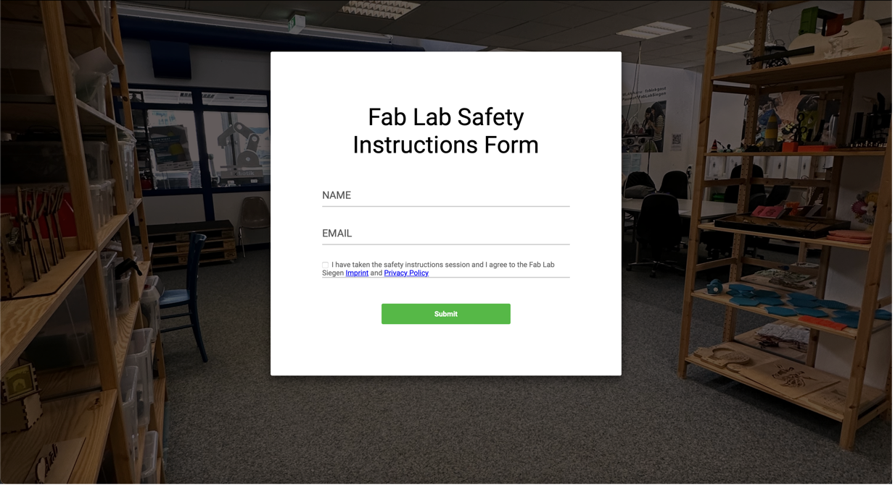
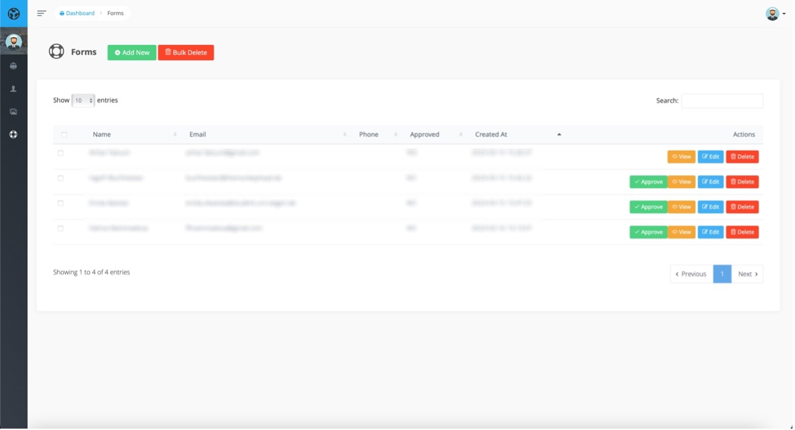

<p align="center"></p>


# Fab Lab Management System

The Fab Lab Management System is designed to enhance the functionality of open labs, specifically Fab Labs, by implementing an open-source management system. This system aims to improve safety, integrity, productivity, and efficiency through a human-centered design with low-cost implementation and a web interface, facilitating scalability to other open labs globally.<br />
Key features include an automated machine access control, restricting machine access to authorized users based on roles and safety instructions using RFID chips. The system centralizes lab management, saving staff time, automating processes, and sending reminders. Additionally, it documents maintenance, supports broken machine repairs, and gathers usage data for AI-supported pattern analysis.

## Screenshots

### Safety Form



### Admin Dashboard


## Usage

### Safety Form

```
https://DOMAIN.com/safety-form
```

### Admin Login

```
https://DOMAIN.com/admin/login
Default Username: admin@fablab.com
Default Password: password
```


## Installation
1. Clone the repository
2. Install dependencies
```
composer install
```
3. Create a .env file
```
cp .env.example .env
```
4. Generate an app encryption key
```
php artisan key:generate
```
5. Create an empty database for the application
6. In the .env file, add database information to allow Laravel to connect to the database
7. Migrate the database
```
php artisan migrate
```
8. Seed the database
```
php artisan db:seed
```
9. Link storage
```
php artisan storage:link
```
10. Install npm dependencies
```
npm install
```
11. Build assets
```
npm run dev
```
12. Run the server
```
php artisan serve
```


### References

- **[FabLab Siegen](https://fablab-siegen.de/)**


## Contributing

Thank you for considering contributing to the Fab Lab Management System! You can submit a PR to this repository and it will be reviewed by a maintainer.

## License

The Fab Lab Management System is open-sourced software licensed under the [MIT license](https://opensource.org/licenses/MIT).
